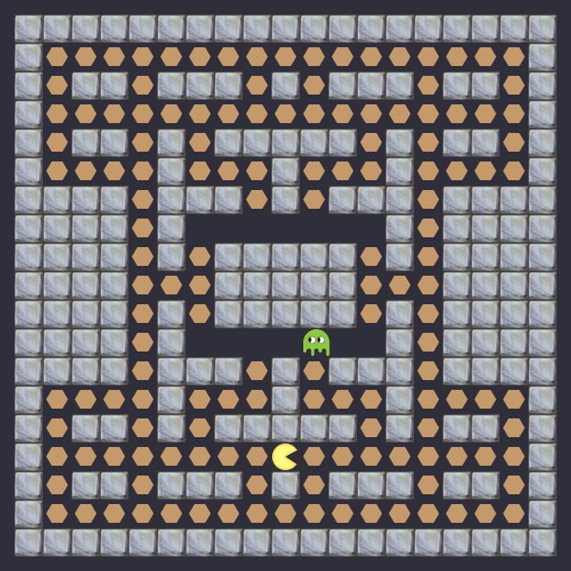

# Pacman

This is a simple Pacman implementation written by me in 2013. Main target of this small project was to avoid using any game engines and to write a simple 2D renderer that supports render tree, transformations and touch handling. Also I had to modernize the code a little bit, so it would compile and run with Xcode 6 :-)

